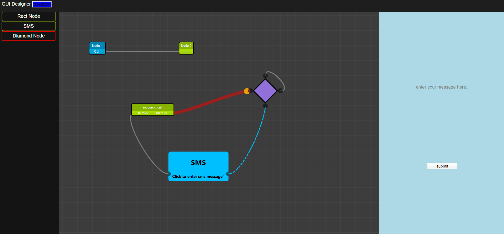

## REACT GUI

This project was bootstrapped with [Create React App](https://github.com/facebook/create-react-app).

**To Install and run type: `yarn start`**

Runs the app in the development mode. 
Open [http://localhost:3000](http://localhost:3000) to view it in the browser.

The page will reload if you make edits. 
You will also see any lint errors in the console.

#### TODO
---
- [x] Serialize 
- [x] Animated Links
- [x] Basic Context Menu and edit properties
- [x] Diamond Node
- [x] Delete nodes
- [x] undo and redo with CTRL-Z and CTRL-Y
- [x] Zoom in and Zoom out
- [ ] DeSerialize
- [ ] Add more custom nodes
- [ ] Grouping of nodes
- [ ] Minimap
